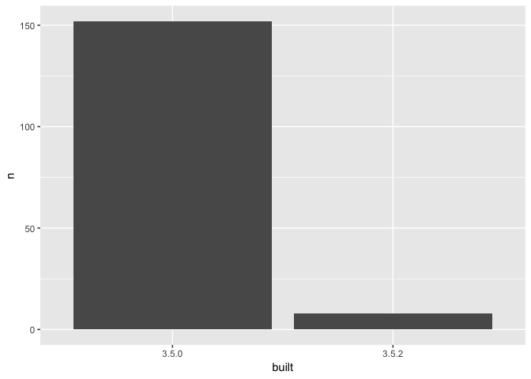

test.R
================
birunda
Tue Jan 15 17:10:35 2019

``` r
#Load Libraries
library(tidyverse)
```

    ## ── Attaching packages ────────────────────────────────────────────────────────────────────────────────── tidyverse 1.2.1 ──

    ## ✔ ggplot2 3.1.0     ✔ purrr   0.2.5
    ## ✔ tibble  2.0.0     ✔ dplyr   0.7.8
    ## ✔ tidyr   0.8.2     ✔ stringr 1.3.1
    ## ✔ readr   1.3.1     ✔ forcats 0.3.0

    ## ── Conflicts ───────────────────────────────────────────────────────────────────────────────────── tidyverse_conflicts() ──
    ## ✖ dplyr::filter() masks stats::filter()
    ## ✖ dplyr::lag()    masks stats::lag()

``` r
library(janitor)
library(data.table)
```

    ## 
    ## Attaching package: 'data.table'

    ## The following objects are masked from 'package:dplyr':
    ## 
    ##     between, first, last

    ## The following object is masked from 'package:purrr':
    ## 
    ##     transpose

``` r
library(magrittr)
```

    ## 
    ## Attaching package: 'magrittr'

    ## The following object is masked from 'package:purrr':
    ## 
    ##     set_names

    ## The following object is masked from 'package:tidyr':
    ## 
    ##     extract

``` r
library(here)
```

    ## here() starts at /Users/birunda/Desktop/RStudioDirectories/Packages-report

``` r
lib_df<-as.data.frame(installed.packages())

lib_df%<>%
  clean_names()

lib_df%<>%
  select(package, lib_path, version, priority, built)

apt <- lib_df %>%
  filter(is.na(priority)) %>%
  select(package, built)

apt_freqtable <- apt %>%
  count(built) %>%
  mutate(perc = scales::percent(n / sum(n)))

ggplot(apt_freqtable, aes(x = built, y = n)) +
  geom_col()
```


